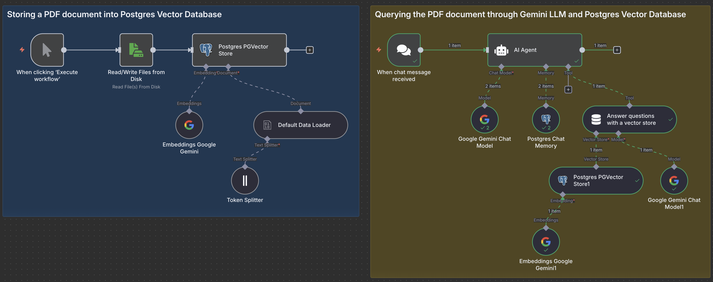

# n8n with PostgreSQL and pgvector Extension

Starts n8n with PostgreSQL as database, including the PGvector extension for vector similarity searches.

## Features

- PostgreSQL database for n8n
- PGvector extension for storing and querying vector embeddings

## What's Possible?

This Docker Compose setup delivers a ready-to-use PostgreSQL database with **PGvector** extension, enabling powerful vector-based AI capabilities right out of the box.

### Example: RAG Workflow with pgvector

The diagram below shows a sample n8n workflow that demonstrates Retrieval-Augmented Generation (RAG) capabilities using the PostgreSQL/pgvector backend:



This example workflow illustrates:
- Document embeddings storage using Google Gemini embeddings 001
- Semantic similarity searches against your vector database
- AI reasoning with Google Gemini Flash 2.0 as the LLM
- A complete RAG pipeline implementation with minimal configuration

## Start

To start n8n with PostgreSQL and pgvector extension, simply run docker-compose by executing the following command in the current folder.

**IMPORTANT:** But before you do that change the default users and passwords in the [`.env`](.env) file!

```
docker-compose up -d
```

To stop it execute:

```
docker-compose stop
```

## Configuration

The default name of the database, user and password for PostgreSQL can be changed in the [`.env`](.env) file in the current directory.

## PGVector Store Information

This setup automatically creates:

1. The pgvector extension in your PostgreSQL database
2. An embeddings table with the following schema:

```sql
CREATE TABLE embeddings (
  id SERIAL PRIMARY KEY,
  embedding vector,
  text text,
  created_at timestamptz DEFAULT now()
);
```

You can use this table to store vector embeddings from AI models for semantic search, similarity comparison, and other vector-based operations in your n8n workflows.

## Accessing PostgreSQL with pgvector

The PostgreSQL instance is exposed on port 15432 (to avoid conflicts with any local PostgreSQL installations). You can connect to it using:

```
psql -h localhost -p 15432 -U [POSTGRES_USER] -d [POSTGRES_DB]
```
